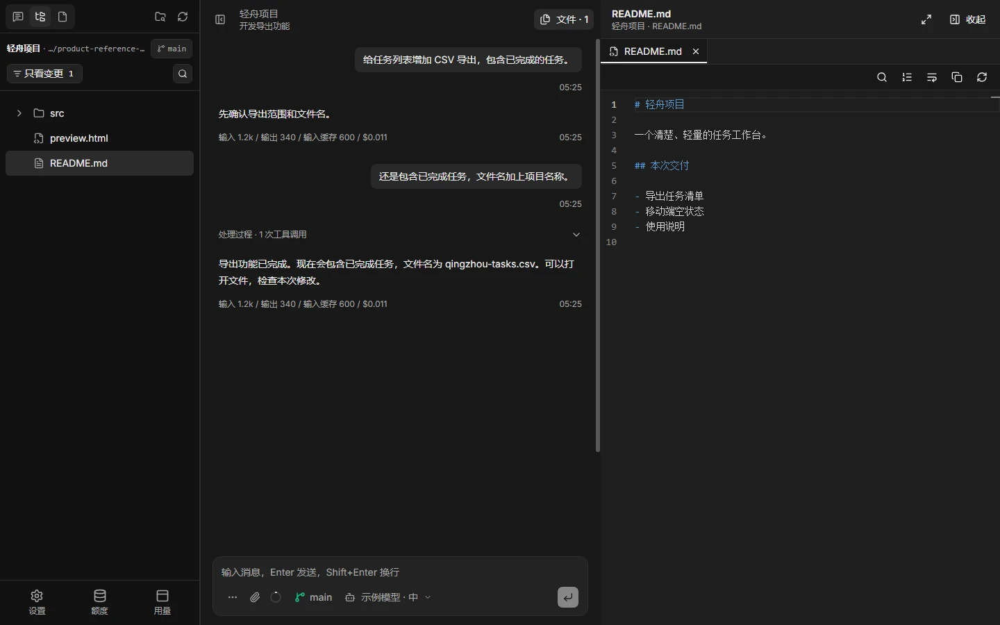
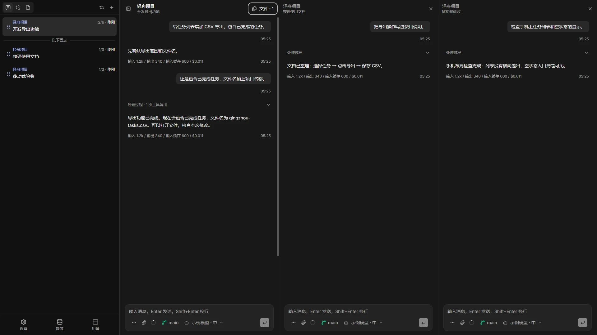

# Pi Desk

[English](./README.md) | **简体中文**

> Pi Desk 坚持简单、轻量。模型迭代很快，能力也在持续增强。我相信，越来越多的复杂工作将由一个更强的模型直接完成。Agent 应保持轻量，减少额外上下文与引导提示词，只保留项目必要的规范；子代理保持轻量、按需使用，避免复杂的团队编排。

面向浏览器、桌面和手机的 Pi 编程代理客户端。

[官网](https://pidesk.dev) · [使用文档](https://pidesk.dev/docs/) · [上游 Pi](https://github.com/earendil-works/pi)

Pi Desk 是 [Pi](https://github.com/earendil-works/pi) 的可视化单用户客户端。你可以同时查看多个会话，预览项目文件与 Git 变更，也可以从另一台设备连接同一个 Pi Desk 服务，接着处理手头的工作。

Pi 负责代理运行，Pi Desk 提供围绕它的工作界面。核心保持轻量，需要的能力通过插件扩展。

## 主要功能

- **多个会话，并排查看。** 固定会话，对照消息与结果，减少来回切换。
- **文件与 Git 随手查看。** 在对话旁边预览项目文件、查看变更和提交历史。
- **不同设备，接着工作。** 使用浏览器，或通过桌面和手机客户端连接同一个服务，查看进度、继续对话。
- **任务与结果集中呈现。** 通过相应插件，在任务中心跟踪后台命令和子代理，并预览交付物。
- **按自己的需要扩展。** 使用 Pi Desk 插件和公共 SDK 添加工具、面板、应用及自定义消息视图。

## 界面演示

<p>
  <a href="./docs/images/client-overview.webp">
    
  </a>
  <a href="./docs/images/multi-window.webp">
    
  </a>
</p>

在 [pidesk.dev](https://pidesk.dev) 查看产品演示，在[使用文档](https://pidesk.dev/docs/)中了解具体操作。

## 快速开始

### 环境要求

- Node.js **22.19.0 或以上**。
- npm（随 Node.js 安装）。
- 兼容的全局 Pi 安装。

如果尚未安装兼容的 Pi：

```bash
npm install -g --ignore-scripts @earendil-works/pi-coding-agent
npm install -g --ignore-scripts @earendil-works/pi-coding-agent --registry=https://mirrors.cloud.tencent.com/npm # 中国用户可改用这个加速下载
```

开始对话前，请在 Pi 中配置模型服务和账号，操作方式见 [Pi 配置指南](https://pi.dev/docs/latest)。没有配置模型时也可以打开客户端，但不能进行模型对话。

### 通过 npm 运行

使用 npx 直接运行：

```bash
npx @jetcrab/pi-desk
npx --registry=https://mirrors.cloud.tencent.com/npm @jetcrab/pi-desk # 中国用户可改用这个加速下载
```

也可以全局安装，方便后续启动：

```bash
npm install -g @jetcrab/pi-desk
npm install -g @jetcrab/pi-desk --registry=https://mirrors.cloud.tencent.com/npm # 中国用户可改用这个加速下载
pi-desk
```

打开 **<http://localhost:6233>**。

## 应用

Web 服务负责运行 Pi 会话，浏览器、桌面和手机客户端连接同一个服务。

| 应用            | 源码                               | 用途                               |
| --------------- | ---------------------------------- | ---------------------------------- |
| Web 服务        | [`src/`](./src) 与 [`bin/`](./bin) | 浏览器客户端与 Pi 集成             |
| Windows         | [`apps/desktop/`](./apps/desktop)  | Tauri 桌面壳                       |
| macOS（实验性） | [`apps/desktop/`](./apps/desktop)  | Tauri 桌面壳                       |
| Android         | [`apps/android/`](./apps/android)  | 连接 Pi Desk 的原生 Android 客户端 |
| iOS（实验性）   | [`apps/ios/`](./apps/ios)          | SwiftUI / WKWebView 客户端         |
| 隧道            | [`apps/tunnel/`](./apps/tunnel)    | Rust TCP 隧道服务与客户端          |

> macOS 和 iOS 客户端目前为实验性支持，尚未纳入稳定版本。作者没有 Mac 和 iOS 设备，未进行实机验证，可能无法正常使用。

## 插件与 SDK

本仓库包含公共 SDK 和九个插件项目。每个插件都是独立包，你可以按需要选择能力，不必把所有功能都加入核心。

| 包                                                                  | 用途                                      |
| ------------------------------------------------------------------- | ----------------------------------------- |
| **[@jetcrab/pi-desk-sdk](./plugins/pi-desk-sdk)**                   | 宿主接口、插件声明和 Browser Host Runtime |
| **[@jetcrab/pi-desk-bg-run](./plugins/pi-desk-bg-run)**             | 后台命令、日志与任务中心集成              |
| **[@jetcrab/pi-desk-subagent](./plugins/pi-desk-subagent)**         | 子代理执行与任务中心集成                  |
| **[@jetcrab/pi-desk-deliverables](./plugins/pi-desk-deliverables)** | 交付物预览                                |
| **[@jetcrab/pi-desk-usage](./plugins/pi-desk-usage)**               | 模型用量与费用分析                        |
| **[@jetcrab/pi-desk-ctx](./plugins/pi-desk-ctx)**                   | 上下文管理与历史工具结果回查              |
| **[@jetcrab/pi-desk-quota-viewer](./plugins/pi-desk-quota-viewer)** | 模型服务额度查看                          |
| **[@jetcrab/pi-desk-tibo-monitor](./plugins/pi-desk-tibo-monitor)** | Tibo 动态与通知                           |
| **[@jetcrab/pi-desk-tool-reason](./plugins/pi-desk-tool-reason)**   | 工具调用理由                              |
| **[@jetcrab/pi-desk-remote-debug](./plugins/pi-desk-remote-debug)** | 开发页面远程调试                          |

插件和 SDK 的更多介绍见[插件概览](./plugins/README.md)。公开 npm 包使用 `@jetcrab/` 命名空间和 npmjs 源。

## 访问与权限

Pi Desk 是具有文件访问、命令执行和插件执行能力的**单用户工具**，不提供多租户执行隔离。

首次启动未配置登录保护时，任何能够访问服务的人都能使用客户端。向他人开放访问前，请在 **设置 → 登录保护** 中设置密码；通过公网访问时使用 HTTPS。

认证数据保存在使用者自己的 Pi Agent 目录，不属于源码仓库。

## 从源码运行

先安装 pnpm，再执行：

```bash
git clone https://github.com/JetCrab/pi-desk.git
cd pi-desk
pnpm install --frozen-lockfile --registry=https://registry.npmjs.org
pnpm install --frozen-lockfile --registry=https://mirrors.cloud.tencent.com/npm # 中国用户可改用这个加速下载
pnpm dev
```

打开 <http://localhost:6233>。首次访问需要编译页面，可能稍慢。

## 致谢

Pi Desk 基于 earendil-works 的可扩展编程代理框架 [Pi](https://github.com/earendil-works/pi) 构建。感谢 Pi 的维护者和贡献者提供代理运行时与基础库，让这个客户端成为可能。

## 许可证

Pi Desk 自有代码采用 [Apache-2.0](./LICENSE)。第三方代码保留原有许可证、版权声明和来源说明。
